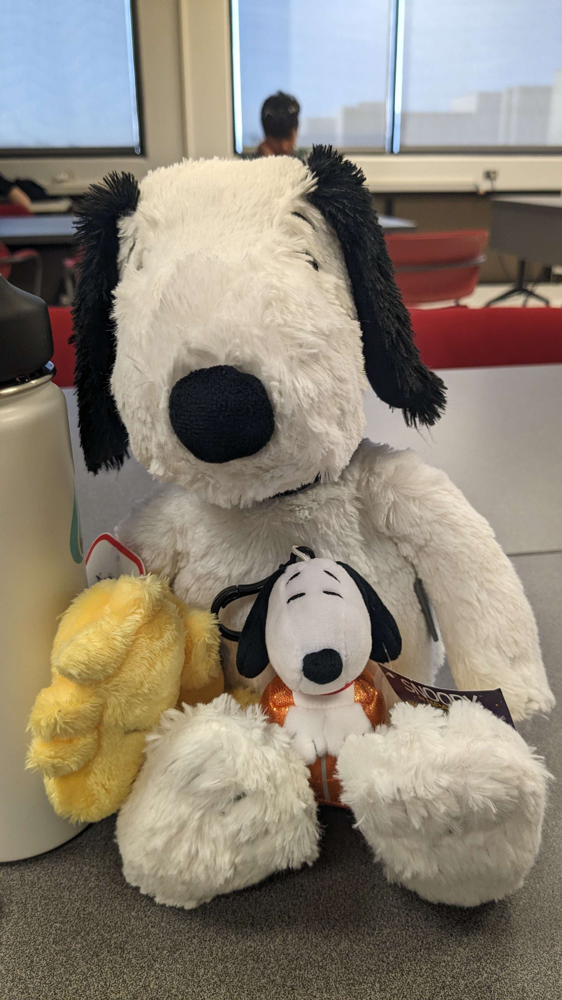
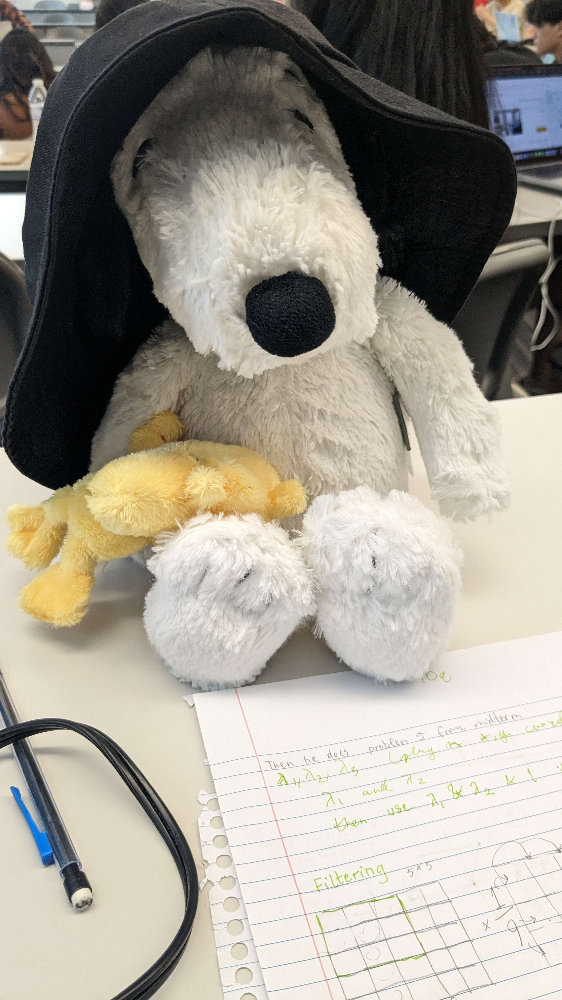
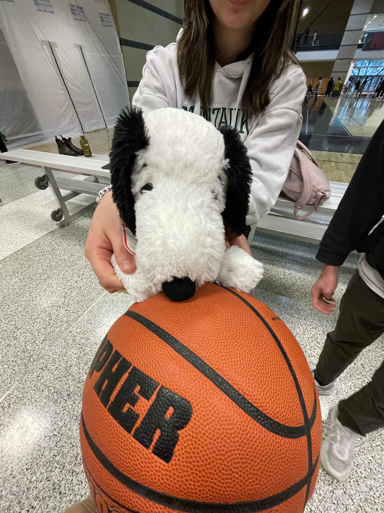
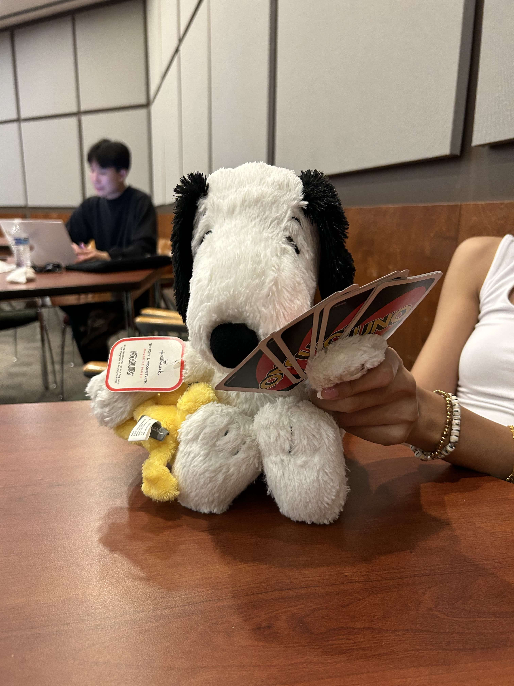

## About me

Hi, I'm just a college student enjoying the mundanities of life and constantly exploring how to be a better programmer. 

My languages based on skill level: 

| Rank | Languages |
|-----:|-----------|
|     1| Python    |
|     2| C++       |
|     3| SQL       |
|     4| Scala     |
|     5| JavaScript|
  

 🔭 On my free time, I’m either revamping my personal website, customizing my configs, or learning more about info sec! My goal is to push out more blog content by the end of this year ✨
    
 p.s. I love snoopy 
    
 
 <foreignObject>
   

     
     
     
     
      
      
   

</foreignObject>
 here are my candid pictures of my snoopy - 2024 

<!--
**Mnguyener/Mnguyener** is a ✨ _special_ ✨ repository because its `README.md` (this file) appears on your GitHub profile.

Here are some ideas to get you started:

- 🔭 I’m currently working on ...
- 🌱 I’m currently learning ...
- 👯 I’m looking to collaborate on ...
- 🤔 I’m looking for help with ...
- 💬 Ask me about ...
- 📫 How to reach me: ...
- 😄 Pronouns: ...
- ⚡ Fun fact: ...
-->

